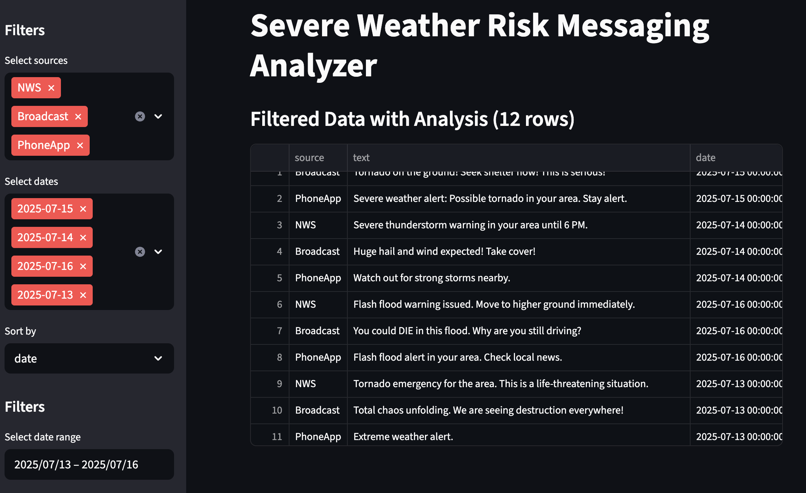
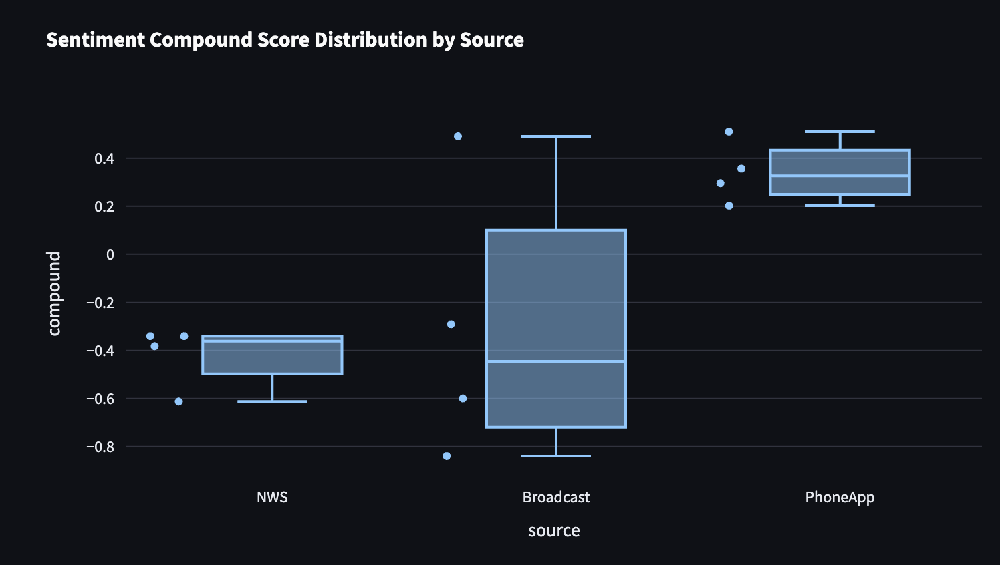

# Severe Weather Risk Messaging Analyzer 🌪️

A Python-based tool for analyzing and visualizing the clarity, urgency, and effectiveness of severe weather warning messages across multiple sources — including the National Weather Service (NWS), broadcast media, and mobile apps.

## Project Rationale

This project was inspired by my personal experience navigating severe weather warnings through various platforms. As someone actively involved in the weather enterprise, I noticed that iPhone alert messages — while timely — were often inconsistent, vague, or even confusing. If they confuse me, a weather communicator, I worry how they impact the general public’s decision-making during life-threatening events.

At the same time, I want to highlight and uplift the important work of the National Weather Service (NWS) and broadcast meteorologists. While the NWS generally follows a consistent, research-backed warning structure, many broadcast meteorologists adapt messaging based on their understanding of local community behavior and needs. That kind of flexibility — when rooted in experience and empathy — can be powerful, even when it deviates from the standard.

This tool does not aim to rank warnings as good or bad by source, but to show a **spectrum** of language and clarity. The goal is to support better, more consistent risk communication across all platforms by showcasing how messaging style impacts comprehension and emotional response.

By analyzing tone, structure, and readability, this tool provides insight into how we can refine severe weather messaging to save lives and reduce confusion.

This project is designed to help researchers, emergency managers, and communicators understand how different messaging styles impact public perception and response during dangerous weather events.

---

## Sample Datasets
### Included in /data:sample_warnings.csv is a collection of warning messages from:
- NWS (official text)
- Broadcast media (TV transcripts or quotes)
- Mobile apps (push alerts)
  
### Each row includes:
- Source (e.g., "NWS", "Broadcast", "App")
- Text (full warning message)
- Date 

## Communication Spectrum Score
Each warning is scored on a composite scale combining:

- Readability: How easy is it to understand?

- Urgency: Does it trigger action?

- Sentiment: Does it feel neutral, alarming, or confusing?

**The goal is not to shame sources but to visualize variation and suggest improvements in crisis communication.**

## Results Overview

### About the Sentiment Score
- Sentiment scores reflect tone, not accuracy.
- Negative scores often mean urgent, clear warnings (good!).
- - NWS scores are clustered, indicating consistent messaging.
- Phone apps may score more positive because they use softer language. This can be a negative in the context of severe weather.
- Positive scores can indicate optimism; not always appropriate for dangerous or severe situations. 
- Use sentiment with other measures for full understanding.

### About the Readability Score
Readability scores (like the Flesch-Kincaid Grade Level) measure how easy or difficult a piece of text is to read and understand. They are important in severe weather communication because clear messaging can save lives.

- Lower readability scores mean the text is easier to read and suitable for a wider audience, including people with varying education levels.
- Higher readability scores indicate more complex text that might be harder for the general public to quickly comprehend during an emergency.

**In this project:** 
- The National Weather Service (NWS) aims for clear, concise language, often resulting in moderate readability scores that balance technical accuracy and public understanding.
- Broadcast media messages may vary widely—some use simpler language, others use more dramatic and complex phrasing. This is highly contingent on their local region & what they respond to.
- Phone app warnings sometimes include brief alerts that are very easy to read, but sometimes vague or lacking detail. No timing or specifics on threat. 

---
License
MIT License. Attribution encouraged for educational and research use.

🔗 Acknowledgments
National Weather Service

SpaCy & NLTK teams

Research inspired by risk communication literature
